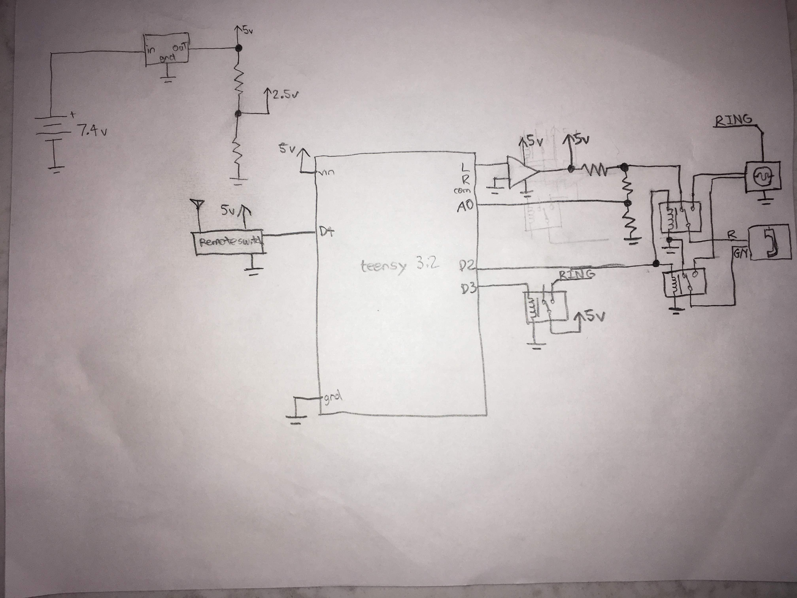
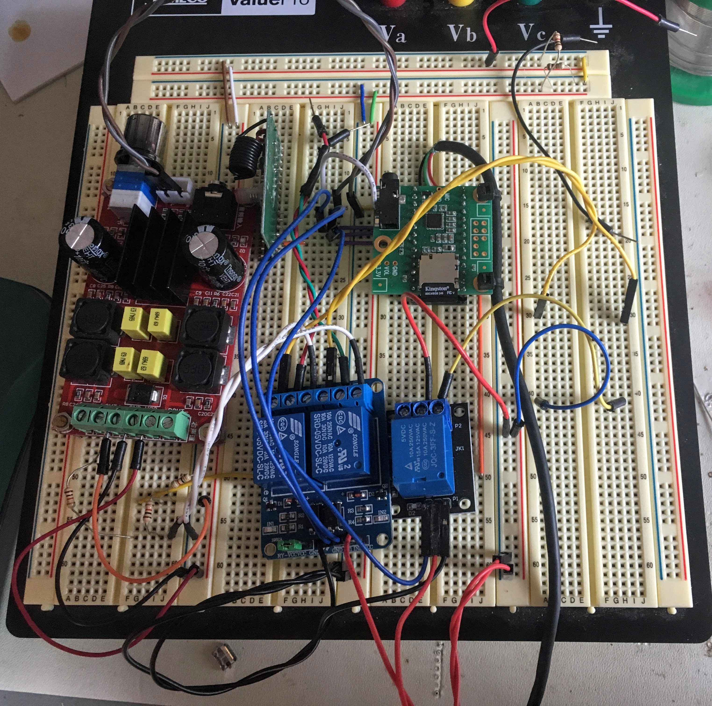

# mobile-poem

A program for Arduino-like systems to interface with old rotary phones.

## How it works

When a proper voltage is supplied to the phone, along with a dial tone, the waveform follows the shape below.

```
     hung up   picked up  dial pulses (3)  ringing     talking    hung up
1.5v -------+             +--+  +--+  +--+                        +--------
            |             |  |  |  |  |  |                        |
0.7v        +-------------+  +--+  +--+  +--v^v^v^----v^v^v^v^v^--+
```

The Teensy can be used to process the analog signals and do things with them. The signals are not as perfect as they are in the illustration. The length of the pulses vary considerably, and the lines are also suceptible to a lot of outside interference. This creates short spikes and other imperfections which must be filtered out.

It is possible to ring the bells built into the phone with a ringer. They require a high voltage (48-96v) sine wave at a low frequency (20 hz). This can be achieved with an inexpensive phone ringer, which can be powered with 5 volts. Three relays are used to control the ringing. The first two isolate the amplifier and Teensy from the high voltage. The third relay supplies the 5 volts to the ringing device, causing it to turn on. See what it looks like [here](doc/ringer.jpg).

I have created a circuit which allows the Teensy to output sound to the phone, detect incoming signals from the phone, and ring the bells according to an external input. The relevant code for the Teensy is in this repository. This code has some definitions at the top which can be modified depending on the specifics of the phone. An oscilloscope was essential in the design of this project to figure out the circuit and how to operate it.

Reference and demos are below.

## Documents and images

**Schematic**



All resistors are 1 kΩ. The relays actually receive external power and the output from the Teensy is only to activate the control circuit on the module (similar to [these](https://www.amazon.com/Tolako-Arduino-Indicator-Channel-Official/dp/B00VRUAHLE/)). The phone wires labeled "R" and "G/Y" correspond to the internal wire colors on the phone we bought. The amplifier in the schematic is not accurate and is only meant as a representation of a readily available amplifier board.

**Breadboard prototype**



Note how the relays are externally powered and only switched on by the microcontroller.

**Finished circuit**


It would have been ideal to have smaller relays and other breakout boards attached to the circuit, but this is what we had. We wanted as much as possible to use what we already had.

**Demo video**

Will be updated soon.